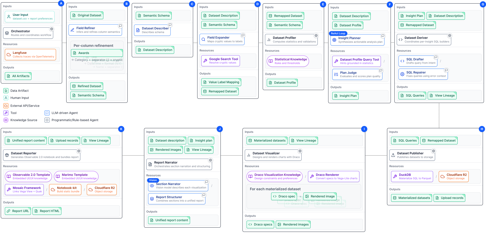

# Agentic Visual Reporting 

[](https://arxiv.org/abs/2509.05721)

> A composable agentic system for automated visual data reporting, implementing a Human-AI Partnership model for transparent and steerable data analysis.

## Overview

This prototype system demonstrates a multi-agent architecture that strategically externalizes logic from LLMs to deterministic modules, leveraging [Draco](https://github.com/cmudig/draco2) for principled visualization design. The system delivers dual outputs:

- **Interactive [Observable](https://github.com/observablehq/notebook-kit) reports** with [Mosaic](https://github.com/uwdata/mosaic) for reader exploration
- **Executable [Marimo](https://marimo.io/) notebooks** for deep, analyst-facing traceability

For complete details, see our [whitepaper](https://arxiv.org/abs/2509.05721).

## Architecture



The system consists of 11 specialized agents orchestrated in a multi-stage pipeline:

1. **Data Understanding**: Field Refiner → Dataset Describer → Field Expander → Dataset Profiler
2. **Analysis**: Insight Planner → Dataset Deriver → Dataset Publisher
3. **Visualization**: Dataset Visualizer (powered by [Draco](https://github.com/cmudig/draco2/pull/949/commits/599fb3c7705e6e0c874fdf37b0c11820ee4056ad))
4. **Reporting**: Report Narrator → Dataset Reporter

Read more in our [whitepaper](https://arxiv.org/abs/2509.05721).

## Gallery

Explore example reports generated by the system in the [gallery](https://peter-gy.github.io/VISxGenAI-2025/gallery/).

## Getting Started

Ready to go deeper? Check out our [Development Guide](DEVELOPMENT.md) for complete setup instructions, API configuration, and usage examples.

## Citation

If you use Agentic Visual Reporting in your work, please cite our workshop paper:

```bibtex
@misc{gyarmati2025ComposableAgenticReporting,
  author = {Gyarmati, Péter Ferenc and
            Moritz, Dominik and
            Möller, Torsten and
            Koesten, Laura},
  title  = {{A Composable Agentic System for Automated Visual Data Reporting}},
  year   = {2025},
  doi    = {10.48550/arXiv.2509.05721},
  url    = {https://visxgenai.github.io/subs-2025/3765/3765-doc.pdf},
  note   = {Workshop paper for the 1st Workshop on GenAI, Agents, and the Future
            of VIS at IEEE VIS 2025.}
}
```
